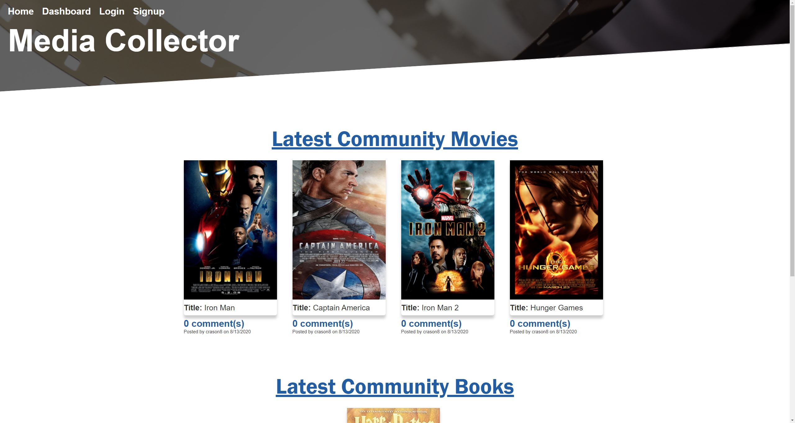
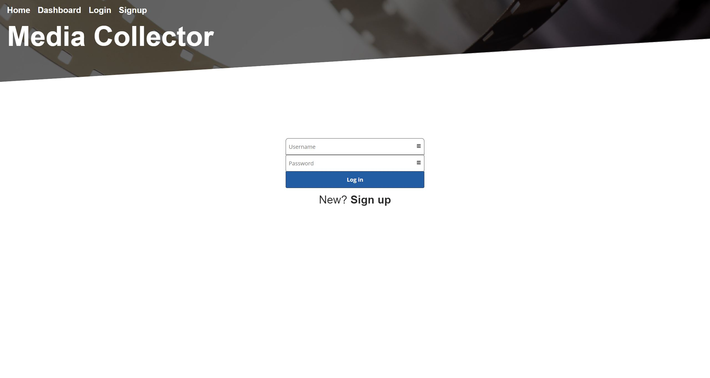

# Media Collector 
Website homepage

## Deployed Links

Repository Link: https://github.com/MasonMarinko/movie-collector

Live URL Link: https://media-collector-project.herokuapp.com/

## Description
Media Collector is a website to help you track and share your media all in one place. It also allows users an easy way to store and share their movies and books with others. As fans of media, we wanted to have a way to share our movies and books with others and we allowed users to talk with others about their favorite media. We have also allowed users to communicate likes and dislikes through comments on specific media.

When you go to the website you are presented with the home page. When the login button is pressed you are brought to a login page. If a user is not signed up yet there is an option to. When a user is logged in they are taken to the dashboard where they can add a new movie or book where they can then comment about the movie or book. Users are also able to edit or delete media on the fly.

### Technologies Used
* Sequelize
* Express
* Handlebars.js
* MySQL
* dotenv
* bcrypt

## Table of Contents
* [Installation](#installation)
* [Usage](#usage)
* [License](#license)
* [Questions](#questions)

## Installation
To View the Application
1. Visit website https://media-collector-project.herokuapp.com/

2. Have fun!

For USE
1. Download repository

2. Create mysql database. App is setup for database named "movie_collector"

3. Use "npm start" to start server, at which point you can open with (localhost:3001) by default. You can then use the app openly.

## Usage/Features (After Installation)
DEMO:

<<<<<<< HEAD

Login Page:

For help in adding books and movies this video can help!

=======

For help in adding books and movies this video can help!

>>>>>>> 41d6e56f142364bbece5617e06853eac8b0b8fc3

For help in adding books and movies this video can help!

## License
This project is covered under the following license(s):
ISC

## Questions? Ask Us:

GitHub Profiles:

- [Mason Marinko](https://github.com/masonmarinko)
- [Paul Throckmorton](https://github.com/siwel20)
- [Matthew McFadden](https://github.com/MatthewMcFadden)

Questions? Contact Us:
<Mason.P.Marinko@gmail.com>, <plthrock@gmail.com>, & <matt.mcfadden14@gmail.com>
